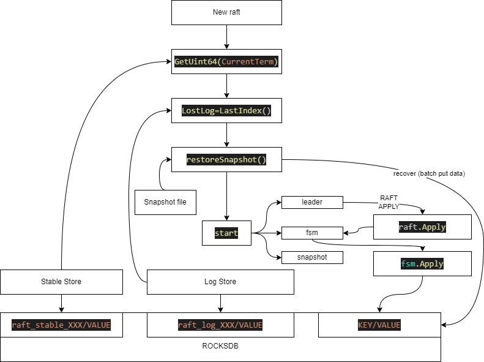

# kubefasthdfs

初次编译, 需要执行makefile, 安装编译rocksdb相关内容, 需要depends包, 该包不在代码仓内
```bash
make 
```
make执行完后会生成sever二进制，

server就是下文中执行的kubefasthdfs，必要时将kubefasthdfs替代为server


整体架构图如下，所有节点均为此架构，leader节点相较于其它节点会有更多功能


# store using mem, bootstrap node
```bash
./kubefasthdfs -id node0 -inmem ~/testkubefasthdfs/node0
```

## using rocksdb to store data
./kubefasthdfs -id node0 ~/testkubefasthdfs/node0

#
```bash
curl -XPOST localhost:11000/key -d '{"user1": "batman"}'
curl -XGET localhost:11000/key/user1
```

## add other node
bool值仅需提供标志 -v，无需指定任何值。flag 包会检测到 -v 标志的存在，并将 verbose 变量设为 true。
总之，传入 flag 包中的布尔型参数时，只需在命令行中指定对应的布尔标志（如 -v），无需提供额外的值。标志的存在表示布尔值为 true，否则保持默认值（通常为 false）。
否则会有异常 -inmem true之类的写法

```bash
./kubefasthdfs -id node1 -inmem -haddr localhost:11001 -raddr localhost:12001 -join localhost:11000 ~/testkubefasthdfs/node1
./kubefasthdfs -id node2 -inmem -haddr localhost:11002 -raddr localhost:12002 -join localhost:11000 ~/testkubefasthdfs/node2
```

## using rocksdb to store data
```bash
./kubefasthdfs -id node1 -haddr localhost:11001 -raddr localhost:12001 -join localhost:11000 ~/testkubefasthdfs/node1
./kubefasthdfs -id node2 -haddr localhost:11002 -raddr localhost:12002 -join localhost:11000 ~/testkubefasthdfs/node2
```

# test other node
```bash
curl -XGET localhost:11000/key/user1
curl -XGET localhost:11001/key/user1
curl -XGET localhost:11002/key/user1
```